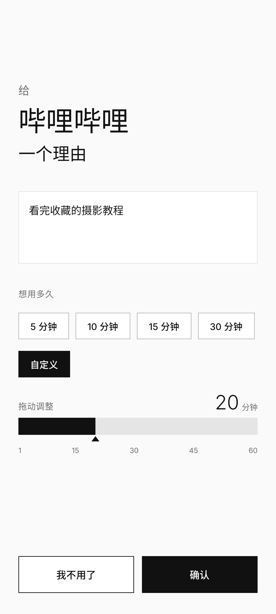
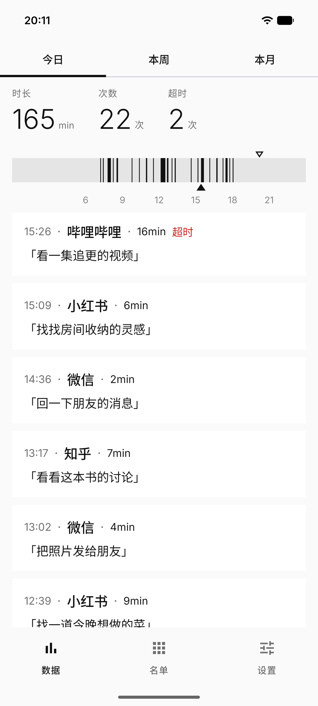
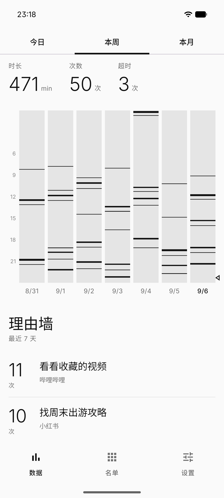
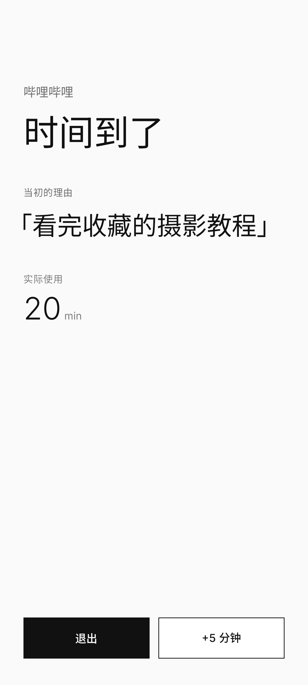
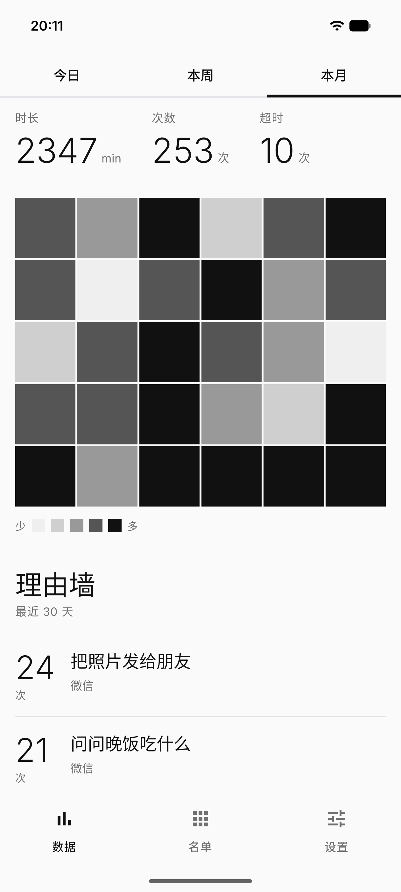
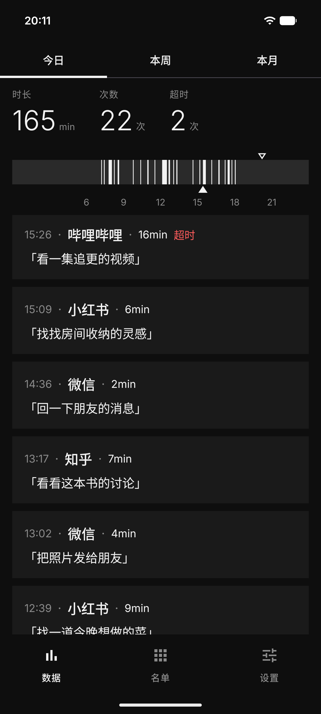

# 给一个理由

**打开之前，先给自己一个理由。**

一个温和但较真的 Android 数字健康工具。打开你选中的 app 时，先写下为什么要用、打算用多久，再开始使用；也可以点「我不用了」，回到桌面。

Android 10+ · 完全离线 · MIT License

## 看看它的样子

以下为真机截图，使用为各视图独立准备的虚构示例数据。时间轴上的每一道条纹，都对应一次有起止时间的使用记录。

| 打开前，写下理由 | 今日，回看每次使用 | 本周，看看使用节奏 |
| --- | --- | --- |
|  |  |  |

| 到点，再作一次选择 | 本月，回看理由与习惯 | 也有深色模式 |
| --- | --- | --- |
|  |  |  |

## 能做什么

- **选好名单**：搜索、分类，勾选容易让你刷掉时间的 app。
- **先写理由，再确认时长**：预设 5 / 10 / 15 / 30 分钟，也能用滑杆选择 1–60 分钟。重复理由会提示当天使用次数，仍可确认。
- **到点提醒**：显示当初的理由，可退出，或最多延长一次 5 分钟。
- **回看使用记录**：今日时间轴、最近 7 天的条纹图、最近 30 天的热力图，以及按重复次数汇总的理由墙。
- **数据留在本机**：无账号、无网络权限。「设置 → 管理记录」可导出 JSON，或预览并清理指定日期之前的历史。界面可选浅色、深色或跟随系统。

这是一个减速带：帮助你把无意识打开 app 的动作，变成一次有意识的选择。它允许你取消、调整名单或卸载，不追求阻止刻意绕过。

## 安装与开始

当前为 `0.1.5` 早期版本，支持 Android 10 及以上。前往 [GitHub Releases](https://github.com/randi0818/reason-app/releases/latest) 下载正式签名的 `reason-app-0.1.5.apk`，同页提供 `SHA256SUMS.txt` 校验文件。自行构建方法见下方「本地构建」。

正式版与 debug 测试版可同时安装，名单和记录各自独立，不会自动迁移。后续正式版可覆盖安装升级，请保留应用数据。

1. 安装后，按引导开启使用情况访问、悬浮窗，以及 Android 13+ 的通知权限。
2. 在「名单」里勾选需要监控的 app。
3. 回到桌面，打开其中一个 app，写下理由并确认时长。

不同 ROM 的后台策略会影响监控，必要时设置允许自启动和电池不限制。没有弹出理由窗时，先检查名单、必要权限和常驻通知。

记录默认全部保留，不会自动清理，也不参与系统云备份或设备迁移。管理记录页可手动清理日期之前已结束的使用记录及相关弹窗结果；跨过该日期或未结束的会话、名单和分类会保留。清理会永久删除理由并减少相关统计，建议先导出留存。目前尚无导入功能，导出的 JSON 不能在应用内恢复已删除记录；卸载或清空存储也会删除本机数据。

## 本地构建

Kotlin / Jetpack Compose / Room / DataStore；前台服务通过 UsageEvents 检测前台，使用全屏悬浮窗提示。

使用 Android Studio 打开项目，安装 Android SDK 35，选择 JDK 17 或 21 后同步。SDK 未定位时，将 `local.properties.example` 复制为 `local.properties` 并填写本机路径。

在项目根目录运行（Windows）：

```powershell
.\gradlew.bat :app:assembleDebug --console=plain
```

macOS / Linux 使用 `sh ./gradlew :app:assembleDebug --console=plain`。调试 APK 位于 `app/build/outputs/apk/debug/app-debug.apk`。

分发 release APK 时，通过 Android Studio 的 **Generate Signed App Bundle / APK → APK** 向导签名，并妥善保存签名密钥；debug 与 release 的数据各自独立。

运行单测与静态检查：

```powershell
.\gradlew.bat :app:testDebugUnitTest :app:lintDebug --console=plain
```

不要同时启动多个 Gradle/KSP 构建。悬浮窗、键盘交互和后台存活还需要真机验证。

## 致谢

这个想法的起点是 B 站 UP 主「老师好我叫何同学」的《这视频能让你戒手机》，以及他做的「时间锁」。

**"打开之前先问自己为什么、打算用多久"这套框架是他提出来的。** 时间锁把「多久」做成了输入，
「为什么」作为提醒出现。

「给一个理由」做的是把「为什么」也变成必须写下来的一句话：它会被存下来，到点原样端回来问你
还继续吗，攒久了就是理由墙。是那支视频让我相信"事前问一句"这件事真的有用。

## 许可证

本项目采用 [MIT License](LICENSE)，版权归 © 2026 GhostySheep 所有。第三方依赖及随附工具仍遵循各自的许可证。
